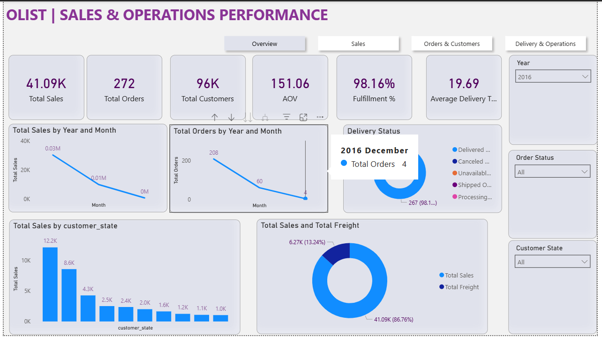
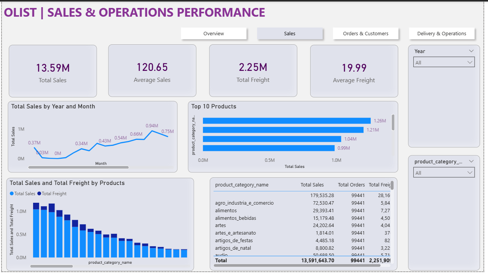
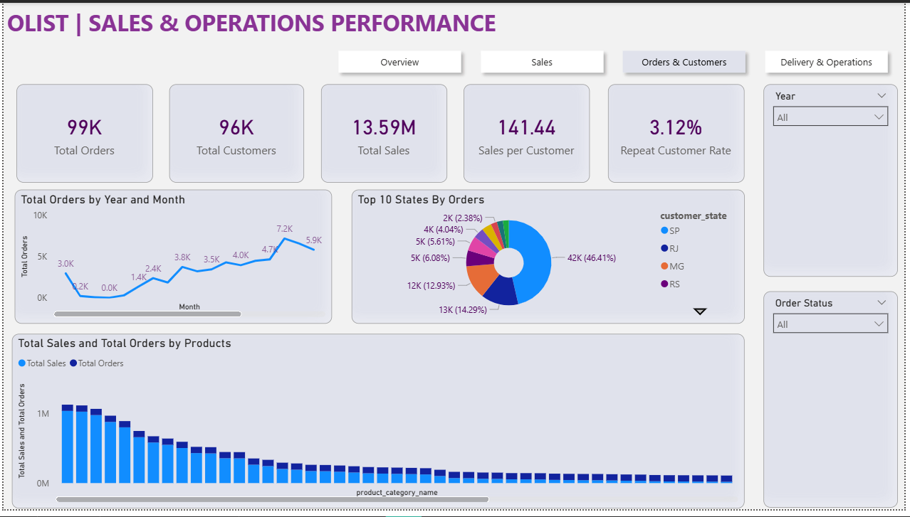
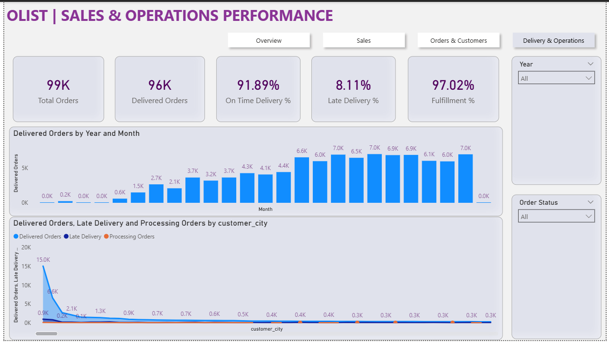

# Olist | E-Commerce Sales & Operations Analysis

## 📌 Project Overview

This project analyzes the **Olist Brazilian E-Commerce dataset** to evaluate sales performance, customer behavior, order trends, product performance, and delivery operations.

The analysis was performed using **PostgreSQL for data exploration and business analysis** and **Power BI for interactive reporting and dashboard development**.

The objective was to transform raw e-commerce data into actionable business insights that can support decisions related to:

- Sales growth
- Customer and geographic performance
- Product and category performance
- Order fulfillment
- Delivery efficiency
- Freight cost
- Operational performance

---

## 🎯 Business Objectives

The project focuses on answering key business questions across four major areas:

### 1. Sales Performance

- How are sales changing over time?
- Which product categories generate the highest sales?
- Which products contribute most to revenue?
- How much freight cost is associated with sales?

### 2. Orders & Customers

- How many orders and customers does the business have?
- Which states and cities generate the highest order volume?
- What is the sales contribution by customer location?
- What is the repeat customer rate?

### 3. Delivery & Operations

- What percentage of orders are successfully fulfilled?
- What percentage of orders are delivered on time?
- How significant are late deliveries?
- What is the average delivery time?
- How do delivery metrics change across years?

### 4. Order & Product Analysis

- Which products and sellers have the highest sales?
- Which product categories generate the highest order volume?
- How do sales and freight costs vary across categories?
- How do order statuses affect sales performance?

---

## 🛠️ Tools & Technologies

| Tool | Purpose |
|------|---------|
| **PostgreSQL** | Data exploration, validation, transformation and SQL analysis |
| **SQL** | Business analysis, aggregations, joins, filtering and KPI calculations |
| **Power BI** | Interactive dashboard development and visualization |
| **DAX** | KPI calculations and analytical measures |

---

## 📂 Dataset

The project uses the **Olist Brazilian E-Commerce dataset**, containing multiple interconnected tables covering customers, orders, products, sellers, payments, reviews and geographic information.

### Major Tables Used

- `customers`
- `orders`
- `order_items`
- `products`
- `product_category_name`
- `sellers`
- `order_payments`
- `order_reviews`
- `geolocation`

The SQL analysis includes table-level validation, uniqueness checks, NULL checks, duplicate checks, aggregation and multi-table analysis.

---


## 🔄 Project Workflow

```text
Raw Olist Dataset
        ↓
Data Understanding
        ↓
Data Validation
        ↓
PostgreSQL Analysis
        ↓
Business KPI Analysis
        ↓
Power BI Data Modeling
        ↓
DAX Measures
        ↓
Interactive Dashboard
        ↓
Business Insights
        ↓
Business Recommendations
```

---

## 📁 Project Structure

```text
Olist-Ecommerce-Sales-Analysis/
│
├── Images/
│   ├── Overview.png
│   ├── Sales.png
│   ├── Orders & Customers (1).png
│   └── Del & Operations (1).png
│
├── SQL/
│   └── olistDb.sql
│
├── PowerBI/
│   └── Olist Dashboard.pbix
│
└── README.md
```

---

## 📌 Key KPIs

| KPI | Value |
|-----|------:|
| Total Orders | 99K |
| Delivered Orders | 96K |
| Total Customers | 96K |
| Total Sales | 13.59M |
| Total Freight | 2.25M |
| Fulfillment Rate | 97.02% |
| On-Time Delivery | 91.89% |
| Late Delivery | 8.11% |
| Repeat Customer Rate | 3.12% |
| Sales per Customer | 141.44 |
| Average Freight | 19.99 |

---
## 📸 Dashboard Preview

### 1. Overview



### 2. Sales Analysis



### 3. Orders & Customers



### 4. Delivery & Operations



---

## 🚀 Conclusion

The Olist e-commerce analysis demonstrates strong overall business performance, characterized by high order fulfillment, substantial sales volume and strong growth in order activity.

At the same time, the analysis highlights important opportunities around **customer retention, late-delivery reduction, freight optimization and geographic performance**.

The combination of **PostgreSQL-based business analysis and Power BI visualization** transforms the underlying e-commerce data into a structured decision-support solution for monitoring sales and operational performance.

---

## 👤 Author

**Arman Haider**

**Data Analyst | SQL | Python | Pandas | Power BI | Excel**
